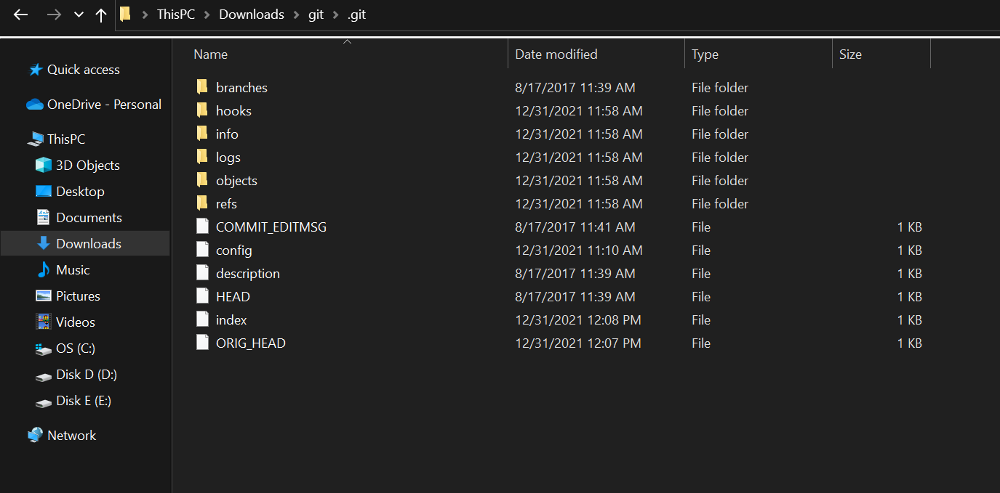
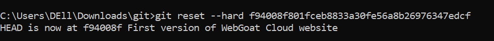
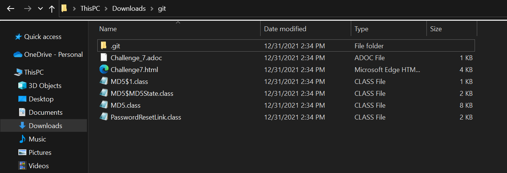
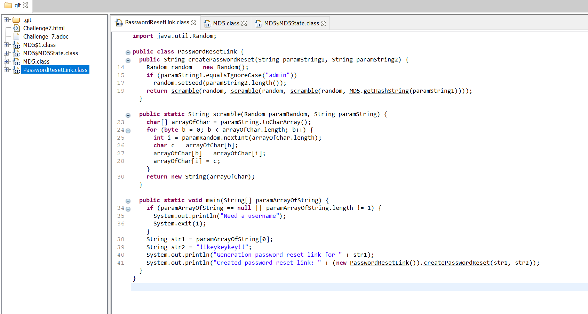
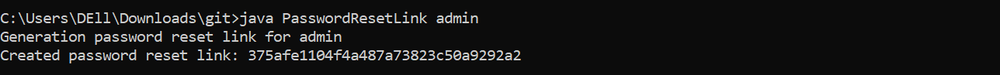
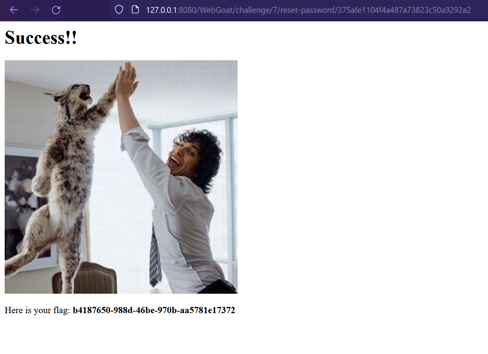

# Admin Password Reset

Send mail for reset password, enter WebWolf and reset it but it need to be a reset link for admin. Seeing some hash in the reset password URL `http://127.0.0.1:8080/WebGoat/challenge/7/reset-password/d6d8685c5d4cebf6f93f01056c5ee2b9`, i guess we need to get the admin's hash to do the reset action.

So, can not modify the parameters; no strange response, i try to brute directory at the challenge's endpoint `/WebGoat/challenge/7/` to see what can happen and after a while, we can see  `.git` file at `/WebGoat/challenge/7/.git`.

Get the file and extract it.



Using `git log` and `git show <commitNo>` to check more details.

```bash
C:\Users\DEll\Downloads\git>git log
commit f94008f801fceb8833a30fe56a8b26976347edcf (HEAD -> master)
Author: Nanne Baars <nanne.baars@owasp.org>
Date:   Thu Aug 17 06:40:04 2017 +0200

    First version of WebGoat Cloud website
```

```bash
C:\Users\DEll\Downloads\git>git show f94008f801fceb8833a30fe56a8b26976347edcf
commit f94008f801fceb8833a30fe56a8b26976347edcf (HEAD -> master)
Author: Nanne Baars <nanne.baars@owasp.org>
Date:   Thu Aug 17 06:40:04 2017 +0200

    First version of WebGoat Cloud website

diff --git a/Challenge7.html b/Challenge7.html
new file mode 100644
index 0000000..93e2404
--- /dev/null
+++ b/Challenge7.html
@@ -0,0 +1,74 @@
+<!DOCTYPE html>
+
+<html xmlns:th="http://www.thymeleaf.org">
+
+
+<div class="lesson-page-wrapper">
+    <div class="adoc-content" th:replace="doc:Challenge_7.adoc"></div>
+    <div class="attack-container">
+        <div class="assignment-success"><i class="fa fa-2 fa-check hidden" aria-hidden="true"></i></div>
+        <div class="container-fluid">
+            <div class="row">
+                <div class="col-md-4">
+                    <div class="panel panel-default">
+                        <div class="panel-body">
+                            <div class="text-center">
+                                <h3><i class="fa fa-lock fa-4x"></i></h3>
+                                <h2 class="text-center">Forgot Password?</h2>
+                                <p>You can reset your password here.</p>
+                                <div class="panel-body">
+
+                                    <form id="login-form" class="attack-form" accept-charset="UNKNOWN"
+                                          method="POST" name="form"
+                                          action="/WebGoat/challenge/7"
+                                          enctype="application/json;charset=UTF-8" role="form">
+
+                                        <div class="form-group">
+                                            <div class="input-group">
+                                                <span class="input-group-addon"><i
+                                                        class="glyphicon glyphicon-envelope color-blue"></i></span>
+                                                <input id="email" name="email" placeholder="email address"
+                                                       class="form-control" type="email"/>
+                                            </div>
+                                        </div>
+                                        <div class="form-group">
+                                            <input name="recover-submit" class="btn btn-lg btn-primary btn-block"
+                                                   value="Reset Password" type="submit"/>
+                                        </div>
+                                        <div class="form-group">
+                                            <p>(c) 2016 WebGoat Cloud Platform</p>
+                                        </div>
+
+                                        <input type="hidden" class="hide" name="token" id="token" value=""/>
+                                    </form>
+
+                                </div>
+                            </div>
+                        </div>
+                    </div>
+                </div>
+            </div>
+        </div>
+        <br/>
+        <form class="attack-form" method="POST" name="form" action="/WebGoat/challenge/flag">
+            <div class="form-group">
+                <div class="input-group">
+                    <div class="input-group-addon"><i class="fa fa-flag-checkered" aria-hidden="true"
+                                                      style="font-size:20px"></i></div>
+                    <input type="text" class="form-control" id="flag" name="flag"
+                           placeholder="a7179f89-906b-4fec-9d99-f15b796e7208"/>+                </div>
+                <div class="input-group" style="margin-top: 10px">
+                    <button type="submit" class="btn btn-primary">Submit flag</button>
+                </div>
+            </div>
+
+        </form>
+
+        <br/>
+        <div class="attack-feedback"></div>
+        <div class="attack-output"></div>
+    </div>
+</div>
+
+</html>
diff --git a/Challenge_7.adoc b/Challenge_7.adoc
new file mode 100644
index 0000000..cb66a43
--- /dev/null
+++ b/Challenge_7.adoc
@@ -0,0 +1 @@
+Try to reset the password for admin.
diff --git a/MD5$1.class b/MD5$1.class
new file mode 100644
index 0000000..766adff
Binary files /dev/null and b/MD5$1.class differ
diff --git a/MD5$MD5State.class b/MD5$MD5State.class
new file mode 100644
index 0000000..4fac53e
Binary files /dev/null and b/MD5$MD5State.class differ
diff --git a/MD5.class b/MD5.class
new file mode 100644
index 0000000..c3340f3
Binary files /dev/null and b/MD5.class differ
diff --git a/PasswordResetLink.class b/PasswordResetLink.class
new file mode 100644
index 0000000..e4fd795
Binary files /dev/null and b/PasswordResetLink.class differ
```

`git reset --hard f94008f801fceb8833a30fe56a8b26976347edcf` to restore files.





PasswordResetLink.class -> File is created

Using jd-gui to read the PasswordResetLink.class



In main, the code will get the username from  paramArrayOfString and create password reset link for each user given. So, just compile and run it and give `admin` as the parameter:



Using the given hash, we can get the flag.


