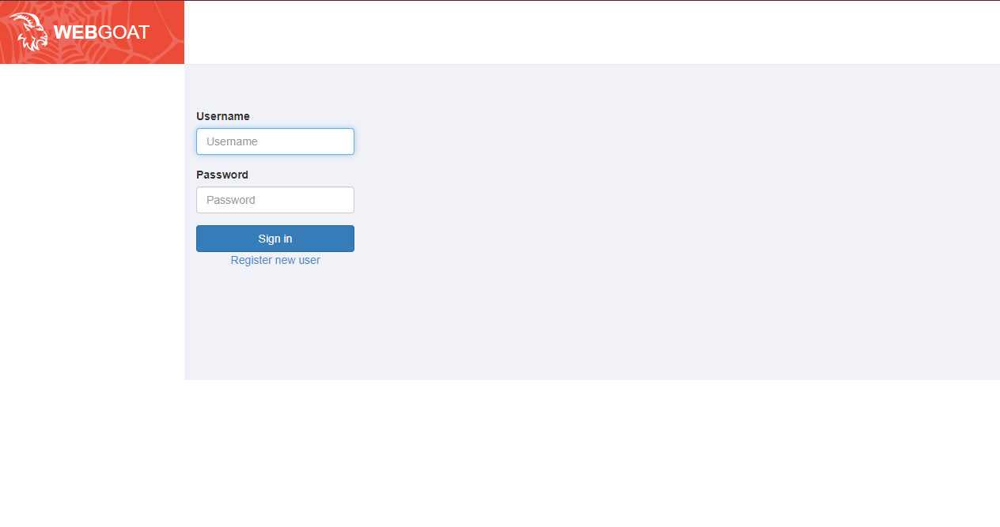
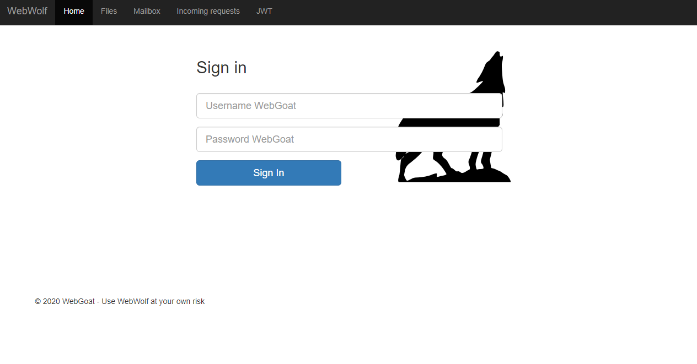

# SET UP

The easiest way also my way is deploying the infratructure through docker.

Command:

`
docker pull webgoat/goatandwolf
`

`
docker run -p 127.0.0.1:8080:8080 -p 127.0.0.1:9090:9090 -e TZ=Europe/Amsterdam webgoat/goatandwolf
` 

The landing page will be located at: 
http://localhost
WebGoat will be located at: http://localhost:8080/WebGoat
WebWolf will be located at: http://localhost:9090/WebWolf

Result:

Register and now you good to go!